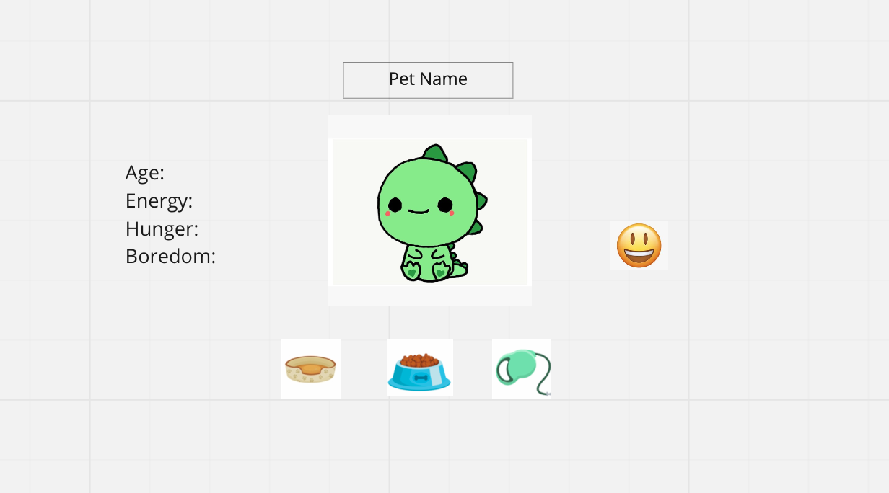

# Tamagotchi

I made a functioning Tamagotchi game except with a dinosaur!

First I made a simple wireframe using Miro.com which can be seen below

I then added multiple features including the below
 - A status emoji that changes if the dino is too hungry, sleepy, bored, or dead 
 - An adult dino image will replace the baby picture when he turns 19
 - Bones will replace the dino image when he dies 
 - The dino will die if age exceeds 30, hunger is at 100%, boredom is at 100% or sleepiness is at 100%